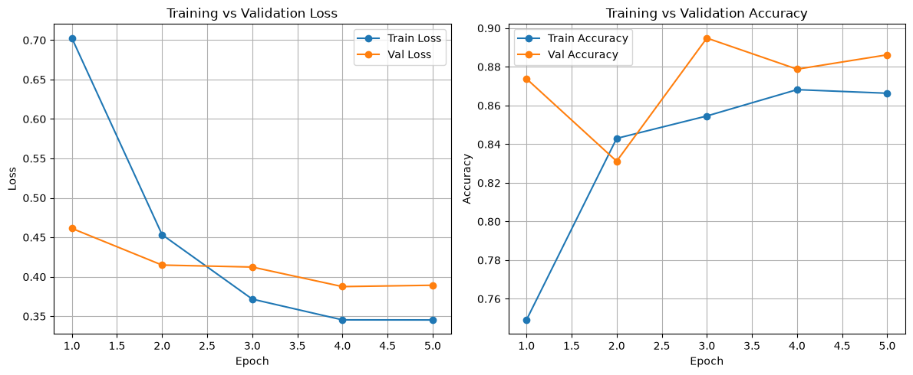
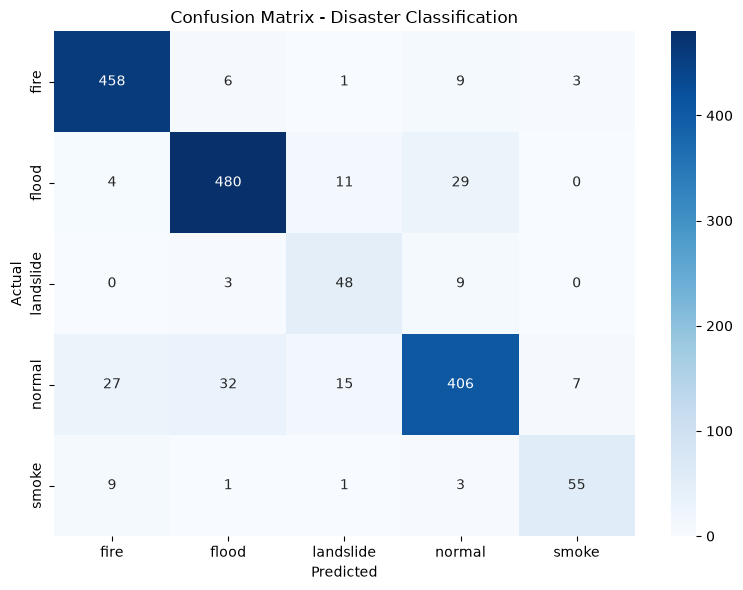

# 🚨 AI-Powered Disaster Intelligence System
 
An AI-powered disaster intelligence platform that combines **Deep Learning**, **Computer Vision**, **Explainable AI**, **Real-Time Weather Intelligence**, and **Risk Assessment** to analyze disaster-related images and assist in disaster monitoring and decision support.
 
The system classifies images into multiple disaster categories and provides visual explanations, risk assessment, weather intelligence, and automated reporting through an interactive Streamlit dashboard.
 
---
 
## 📌 Project Overview
 
This project uses **MobileNetV2 Transfer Learning** to classify disaster-related images into five categories:
 
| Category | Emoji |
|---|---|
| Fire | 🔥 |
| Flood | 🌊 |
| Landslide | ⛰️ |
| Smoke | 🌫️ |
| Normal | ✅ |
 
---
 
## ✨ Features
 
### 🤖 AI Disaster Classification
- Multi-class disaster image classification
- MobileNetV2-based transfer learning model
- Confidence score generation
- Fast inference
### 🔍 Explainable AI
- Grad-CAM visualization
- Model decision interpretation
- Visual attention heatmaps
### 📊 Risk Assessment
- Single image analysis
- Batch area risk assessment
- Risk zone categorization
- Confidence-based evaluation
### 🌍 Real-Time Weather Intelligence
- OpenWeatherMap API integration
- Live weather monitoring
- Temperature and humidity tracking
- Weather-aware risk evaluation
### 🚨 Disaster Intelligence
- Disaster feed integration
- Risk scoring engine
- Situational awareness support
### 📄 Automated Reporting
- PDF report generation
- Prediction summaries
- Risk assessment reports
### 🖥️ Interactive Dashboard
- Streamlit-based UI
- Visualization tools
- Real-time prediction interface
---
 
## 🏗️ System Architecture
 
```
Image Input
     │
     ▼
Preprocessing
     │
     ▼
MobileNetV2 Model
     │
     ▼
Prediction + Confidence
     │
     ├── Grad-CAM Visualization
     ├── Weather Intelligence
     └── Disaster Feed
          │
          ▼
      Risk Engine
          │
          ▼
  Dashboard + PDF Report
```
 
---
 
## 📊 Dataset
 
**Source:** [Kaggle – Disaster Damage 5-Class Dataset](https://www.kaggle.com/)
 
| Class | Images |
|---|---|
| Fire | 2537 |
| Flood | 2706 |
| Landslide | 310 |
| Normal | 2226 |
| Smoke | 302 |
| **Total** | **8081** |
 
**Challenges:**
- Significant class imbalance
- Limited computational resources
- Small sample sizes for Landslide and Smoke classes
---
 
## 🧠 Model
 
### Architecture
- **Base Model:** MobileNetV2 (Pretrained on ImageNet)
- **Head:** Custom classification layer
- **Approach:** Transfer Learning
### Why MobileNetV2?
- Lightweight architecture
- Fast training and inference
- Suitable for limited hardware resources
- Strong performance on image classification tasks
### Training Strategy
- Frozen backbone with trained classifier head
- **Loss Function:** Weighted Cross-Entropy Loss
- **Class Imbalance Handling:** `compute_class_weight()` from Scikit-Learn
---
 
## 📈 Model Performance
 
**Validation Accuracy: 89%**
| Class | Precision | Recall | F1-Score |
|-----------|-----------|--------|----------|
| Fire | 0.92 | 0.96 | 0.94 |
| Flood | 0.92 | 0.92 | 0.92 |
| Landslide | 0.63 | 0.80 | 0.71 |
| Normal | 0.89 | 0.83 | 0.86 |
| Smoke | 0.85 | 0.80 | 0.82 |

### Training Curves


### Confusion Matrix


## 🛠️ Technology Stack
 
| Category | Technology |
|---|---|
| Programming Language | Python |
| Deep Learning | PyTorch, Torchvision |
| Computer Vision | OpenCV |
| Data Processing | NumPy, Pandas |
| Visualization | Matplotlib, Seaborn |
| Machine Learning | Scikit-Learn |
| Dashboard | Streamlit |
| APIs | OpenWeatherMap API |
 
---
 
## 📂 Project Structure
 
```
AI_Disaster_Intelligence_System/
│
├── app.py
├── weather_service.py
├── disaster_feed.py
├── risk_engine.py
│
├── src/
│   ├── model.py
│   ├── predict.py
│   ├── gradcam.py
│   └── utils.py
│
├── reports/
├── sample_images/
├── notebooks/
├── requirements.txt
├── README.md
└── .gitignore
```
 
---
 
## 🚀 Installation
 
### 1. Clone Repository
```bash
git clone https://github.com/aayushi1806sharma-afk/Repository-name-AI-Disaster-Intelligence-System.git
cd Repository-name-AI-Disaster-Intelligence-System
```
 
### 2. Create Virtual Environment
```bash
python -m venv venv
```
 
### 3. Activate Environment
 
**Windows:**
```bash
venv\Scripts\activate
```
 
**Linux / Mac:**
```bash
source venv/bin/activate
```
 
### 4. Install Dependencies
```bash
pip install -r requirements.txt
```
 
### 5. Run Application
```bash
streamlit run app.py
```
 
---
 
## 🌦️ Weather API Configuration
 
Create a `.env` file in the root directory and add your API key:
 
```env
OPENWEATHER_API_KEY=your_api_key_here
```
 
Get your free API key at [openweathermap.org](https://openweathermap.org/api).
 
---
 
## 🎯 Future Improvements
 
- [ ] Satellite image integration
- [ ] GIS mapping support
- [ ] Live disaster alert dashboards
- [ ] Multi-disaster severity estimation
- [ ] Cloud deployment
- [ ] Mobile application support
---
 
## 📚 Learning Outcomes
 
This project provided hands-on experience in:
 
- Transfer Learning
- Computer Vision
- Deep Learning
- Model Deployment
- Explainable AI (Grad-CAM)
- Risk Assessment Systems
- Streamlit Application Development
- API Integration
- End-to-End ML Project Development
---
 
## 👩‍💻 Author
 
**Aayushi Sharma**
Final Year B.Tech Student
 
Passionate about Artificial Intelligence, Machine Learning, Deep Learning, Computer Vision, and Software Development.
 
---
 
⭐ If you found this project useful, consider giving the repository a star!
 
